# Yaip — System Architecture

## Overview

Yaip is a real-time iOS messaging app with AI features, built on SwiftUI + Firebase with an offline-first, optimistic UI design. AI processing is delegated to N8N workflow webhooks backed by OpenRouter (OpenAI-compatible API, using free-tier models), with Pinecone providing vector search.

```
+---------------------------------------------------------------------+
|                         iOS App (SwiftUI)                           |
|                                                                     |
|   Views --> ViewModels --> Protocols --> Services / Managers         |
|                                 ^v                                  |
|                           SwiftData (Local)                         |
+------------+------------------+------------------+------------------+
             |                  |                  |
             v                  v                  v
      +-----------------+ +-------------+ +-------------+
      |  Firebase        | |  N8N        | |  Pinecone   |
      |  - Auth          | |  Webhooks   | |  Vector DB  |
      |  - Firestore     | |  - OpenRouter| |  (RAG)      |
      |  - Storage       | |  (free models)| +-------------+
      |  - Realtime DB   | +-------------+
      +-----------------+
```

---

## Layer Architecture

### 1. Views (43 files)

Purely presentational SwiftUI views. No business logic, no direct Firebase access.

```
Views/
+-- Auth/            WelcomeView, LoginView, SignUpView, ProfileSetupView
+-- Chat/            ChatView, UnifiedMessageBubble, MessageComposer, ...
+-- Conversations/   ConversationListView, ConversationRow, NewChatView
+-- AIFeatures/      ThreadSummaryView, ActionItemsView, SmartSearchView, ...
+-- Settings/        SettingsView, ProfileSettingsView, CalendarSettingsView, ...
+-- Components/      ErrorToast, OnlineStatusBadge, ReactionPickerView, ...
+-- Shared/          UserProfileModal
```

Views bind to ViewModels via `@StateObject` / `@ObservedObject` and call ViewModel methods for user actions.

### 2. ViewModels (5 ViewModels across 8 files)

Business logic and state management. All are `@MainActor` `ObservableObject` classes.

| ViewModel | File(s) | Responsibility |
|-----------|---------|---------------|
| `ChatViewModel` | Core + 3 extensions | Coordinator — owns dependencies, routes to extensions |
| `+ Messaging` | `ChatViewModel+Messaging.swift` | Send, retry, merge, listen, markAsRead |
| `+ Interactions` | `ChatViewModel+Interactions.swift` | Reactions, deletion, replies (optimistic UI) |
| `+ Presence` | `ChatViewModel+Presence.swift` | Typing indicators with auto-stop timer |
| `ConversationListViewModel` | 1 file | Conversation CRUD, filtering, mark-all-read |
| `AIFeaturesViewModel` | 1 file | All 6 AI features, calendar event creation |
| `PendingChatViewModel` | 1 file | New conversation flow before first message |
| `UserSearchViewModel` | 1 file | User search with 300ms debounce |

### 3. Protocols (12 protocols across 11 files)

Every service and manager conforms to a protocol. ViewModels depend on protocols, not concrete types, enabling unit testing with mock implementations.

```
ViewModels depend on:
  MessageServiceProtocol        -> MessageService.shared
  ConversationServiceProtocol   -> ConversationService.shared
  AuthManagerProtocol           -> AuthManager.shared
  LocalStorageManagerProtocol   -> LocalStorageManager.shared
  ImageUploadManagerProtocol    -> ImageUploadManager.shared
  NetworkMonitorProtocol        -> NetworkMonitor.shared
  UserServiceProtocol           -> UserService.shared
  StorageServiceProtocol        -> StorageService.shared
  PresenceServiceProtocol       -> PresenceService.shared
  N8NServiceProtocol            -> N8NService.shared
  CalendarManagerProtocol       -> CalendarManager.shared
  EventCreatorProtocol          -> AppleCalendarService()
```

Default values in `init` parameters mean zero call-site changes — production code uses singletons, tests inject mocks.

### 4. Services (11 files)

Firebase and external API operations. No UI knowledge.

| Service | Backend | Purpose |
|---------|---------|---------|
| `MessageService` | Firestore | Message CRUD, snapshot listeners, read receipts, reactions, replies |
| `ConversationService` | Firestore | Conversation CRUD, listeners, unread counts, participant management |
| `UserService` | Firestore | User CRUD, in-memory cache (5-min TTL), prefix search |
| `StorageService` | Firebase Storage | Image upload/delete with resize and compression |
| `PresenceService` | Firestore + Realtime DB | Online/away/offline status, heartbeat (30s), auto-disconnect |
| `N8NService` | N8N Webhooks | All AI features (7 endpoints), mock fallback for testing |
| `MessageIndexingService` | N8N -> Pinecone | Vector indexing for RAG search, offline queue |
| `MessageListenerService` | Firestore | Background listener for in-app/local notifications |
| `AppleCalendarService` | EventKit | Native calendar read/write, availability checks |
| `GoogleCalendarService` | Google API | Google Calendar (stub, requires OAuth) |
| `CalendarProvider` | — | Protocol + types for multi-provider calendar |

### 5. Managers (6 files)

Shared application-level state. All singletons.

| Manager | Purpose |
|---------|---------|
| `AuthManager` | Firebase Auth state, sign-up/in/out, Google Sign-In, profile sync |
| `ImageUploadManager` | Three-state image lifecycle (cache -> upload -> done), per-message tracking |
| `LocalStorageManager` | SwiftData persistence for offline messages and conversations |
| `CalendarManager` | Multi-provider calendar coordination (Apple + Google), persisted to UserDefaults |
| `LocalNotificationManager` | Local push notifications, badge count (max 99), deep-linking |
| `ThemeManager` | System/light/dark theme, persisted to UserDefaults |

### 6. Utilities (8 files)

Cross-cutting infrastructure.

| Utility | Purpose |
|---------|---------|
| `NetworkMonitor` | NWPathMonitor wrapper — **UI feedback only, never blocks operations** |
| `NetworkStateViewModifier` | Offline banner + reconnect callback |
| `AnalyticsService` | Firebase Analytics wrapper with typed events |
| `AppLogger` | Structured `os.log` with categories (Messages, Auth, Network, Storage, Sync, AI) |
| `ListenerBag` | Firestore listener lifecycle management (keyed storage, auto-cleanup in deinit) |
| `Strings` (L10n) | Centralized localization strings via `String(localized:defaultValue:)` |
| `UserFacingError` | Typed error enum with user-safe messages |
| `Constants` | Firestore collection names, notification names |

### 7. Extensions (5 files)

| Extension | Purpose |
|-----------|---------|
| `Color+Extensions` | Reusable color constants for theming |
| `Date+Extensions` | Date formatting helpers |
| `String+Extensions` | String utilities |
| `UIImage+Extensions` | Image resizing and compression |
| `Firestore+Extensions` | Firestore query helpers (`.decoded()`, snapshots) |

---

## Data Models

### Message

```
Message
+-- id: String?                    # Firestore document ID
+-- conversationID: String
+-- senderID: String
+-- text: String?                  # nil for image-only messages
+-- mediaURL: String?              # Firebase Storage download URL
+-- mediaType: .image | .video
+-- timestamp: Date
+-- status: MessageStatus
|   +-- .staged    -+
|   +-- .sending   -+ Local (unsynced)
|   +-- .failed    -+
|   +-- .sent      -+
|   +-- .delivered -+ Synced
|   +-- .read      -+
+-- readBy: [String]               # User IDs
+-- reactions: [emoji: [userIDs]]
+-- replyTo: String?               # Parent message ID
+-- isDeleted: Bool
+-- deletedAt: Date?

Computed: isFromCurrentUser(), totalReactions, userReacted()
Status:   isLocal, isSynced, isRetryable
```

### Conversation

```
Conversation
+-- id: String?
+-- type: .oneOnOne | .group
+-- participants: [String]         # User IDs
+-- name: String?                  # Groups only
+-- imageURL: String?              # Group avatar
+-- lastMessage: LastMessage?      # Preview for list
|   +-- text, senderID, timestamp
+-- createdAt: Date
+-- updatedAt: Date
+-- unreadCount: [userID: Int]     # Per-user badge count

PendingConversation — pre-creation wrapper with toConversation() converter
```

### User

```
User
+-- id: String?
+-- displayName: String
+-- email: String
+-- profileImageURL: String?
+-- status: .online | .offline | .away
+-- lastSeen: Date
+-- fcmToken: String?
+-- createdAt: Date
```

### AI Models (defined in N8NService)

| Model | Key Fields |
|-------|------------|
| `ThreadSummary` | summary, messageCount, confidence, timestamp |
| `ActionItem` | task, priority, status (.pending/.completed), assignee, deadline |
| `MeetingSuggestion` | detectedIntent, suggestedTimes, duration, participants |
| `TimeSlot` | date, startTime, endTime, isUserFree |
| `Decision` | decision text, context, impact, category |
| `PriorityMessage` | messageID, content, priority (0-10), reason |
| `SearchResult` | messageID, content, timestamp, sender |
| `RAGSearchResult` | results, aiAnswer, answerSources, query |

---

## Key Data Flows

### 1. Message Send Lifecycle

```
User taps Send
    |
    v
+-------------------------------+
| STAGE 1: Staged               |
| - Create message (.staged)    |
| - Add to UI immediately       |<-- Optimistic UI
| - Save to SwiftData           |
+---------------+---------------+
                |
    +-----------+-----------+
    | Has image?            |
    |                       |
    v Yes                   v No
+-----------------+         |
| STAGE 2: Upload |         |
| - Cache to disk |         |
| - Upload to     |         |
|   Firebase      |         |
|   Storage       |         |
| - Get URL       |         |
+--------+--------+         |
         |                  |
         +--------+---------+
                  |
                  v
+-------------------------------+
| STAGE 3: Sending              |
| - Set status .sending         |
| - Write to Firestore          |<-- Firebase SDK queues if offline
| - Update conversation preview |
| - Increment unread counts     |
+---------------+---------------+
                |
                v
+-------------------------------+
| STAGE 4: Sent                 |
| - Set status .sent            |
| - Mark synced in SwiftData    |
| - Log analytics event         |
+---------------+---------------+
                |
                v
+-------------------------------+
| STAGE 5: Index                |
| - Send to N8N /ingest_message |
| - N8N generates embedding     |
| - Store in Pinecone           |
+-------------------------------+

On failure at any stage -> status = .failed -> retry on reconnect
```

### 2. Message Merge Algorithm

When a Firestore snapshot arrives, the merge preserves local message state:

```
For each message in Firestore snapshot:
  +-- Exists locally with local status (.staged/.sending/.failed)?
  |   +-- Keep local version (local state is more current)
  +-- Exists locally with synced status (.sent/.delivered/.read)?
  |   +-- Use Firestore version (source of truth)
  +-- New message?
      +-- Add to list

Then: append local-only messages not yet in Firestore
Then: sort all by timestamp ascending
```

### 3. Offline -> Reconnect Flow

```
Network disconnects
    |
    v
NetworkMonitor.isConnected = false
    |
    +-- UI: orange "No internet" banner
    +-- Messages sent with .staged status
    +-- Images cached to disk
    +-- Vector indexing queued

Network reconnects
    |
    v
NetworkMonitor posts .networkDidReconnect
    |
    +-- ChatViewModel.retryAllFailedMessages()
    |   +-- Find .staged and .failed messages
    |   +-- Re-upload images if needed
    |   +-- Re-send to Firestore
    |
    +-- MessageIndexingService.processOfflineQueue()
    |   +-- Re-index queued messages to Pinecone
    |
    +-- ChatView.onNetworkReconnect
        +-- Reload user presence status
```

### 4. AI Feature Flow

```
User taps AI feature (e.g., "Summarize Thread")
    |
    v
AIFeaturesViewModel.summarizeThread()
    |
    v
N8NService.summarizeThread(conversationID)
    |
    +-- POST /summarize  -->  N8N Webhook
    |                          |
    |                          +-- Fetch messages from Firestore
    |                          +-- Call OpenRouter LLM (free model)
    |                          +-- Enrich with user names
    |                          +-- Return structured JSON
    |
    v
Parse response -> ThreadSummary model
    |
    v
Show ThreadSummaryView sheet
    |
    v
AnalyticsService.logAIFeatureUsed("summarize")
```

All 7 N8N endpoints follow this pattern:

| Endpoint | Request | Response Model |
|----------|---------|---------------|
| `/summarize` | conversationID, messageCount | `ThreadSummary` |
| `/extract_actions` | conversationID, dateRange | `[ActionItem]` |
| `/schedule_meeting` | conversationID, context | `MeetingSuggestion` |
| `/track_decisions` | conversationID | `[Decision]` |
| `/detect_priority` | conversationID | `[PriorityMessage]` |
| `/search` | conversationID, query | `[SearchResult]` |
| `/rag_search` | conversationID, query | `RAGSearchResult` (results + AI answer) |

### 5. Notification Flow

```
Firestore listener detects new message
    |
    v
MessageListenerService.handleNewMessage()
    |
    +-- Skip if from current user
    +-- Skip if already processed (dedup)
    +-- Skip if user is viewing this conversation
    |
    +-- Fetch sender name from users collection
    |
    +--> In-app banner (InAppBannerView)
    |    +-- Tappable -> deep links to message
    |
    +--> LocalNotificationManager
         +-- Title: sender name (or group name)
         +-- Body: message text or "Sent a photo"
         +-- Badge: total unread count (max 99)
         +-- On tap -> post .openConversation -> navigate to chat
```

### 6. Meeting Suggestion + Calendar Flow

```
AIFeaturesViewModel.suggestMeetingTimes()
    |
    v
N8NService -> MeetingSuggestion with TimeSlots
    |
    v
Fetch participant names from Firestore
    |
    v
CalendarManager.checkAvailability(timeSlots)
    |
    +-- AppleCalendarService (EventKit)
    +-- GoogleCalendarService (if connected)
    |
    v
Enrich TimeSlots with isUserFree status
    |
    v
User selects time slot
    |
    v
EventCreatorProtocol.createEvent() -> EventKit
    |
    v
Send confirmation message to conversation
```

---

## Firebase Schema

```
Firestore
+-- conversations/{conversationID}
|   +-- type: "oneOnOne" | "group"
|   +-- participants: [userID, ...]
|   +-- name: String?                    # Group name
|   +-- imageURL: String?                # Group avatar
|   +-- lastMessage: {text, senderID, timestamp}
|   +-- unreadCount: {userID: count, ...}
|   +-- createdAt: Timestamp
|   +-- updatedAt: Timestamp
|   |
|   +-- messages/{messageID}             # Subcollection
|   |   +-- conversationID: String
|   |   +-- senderID: String
|   |   +-- text: String?
|   |   +-- mediaURL: String?
|   |   +-- mediaType: "image" | "video"
|   |   +-- timestamp: Timestamp
|   |   +-- status: "staged"|"sending"|"sent"|"delivered"|"read"|"failed"
|   |   +-- readBy: [userID, ...]
|   |   +-- reactions: {emoji: [userID, ...]}
|   |   +-- replyTo: String?
|   |   +-- isDeleted: Bool
|   |   +-- deletedAt: Timestamp?
|   |
|   +-- presence/{userID}                # Typing indicators (subcollection)
|       +-- isTyping: Bool
|       +-- timestamp: Timestamp
|
+-- users/{userID}
    +-- displayName: String
    +-- email: String
    +-- profileImageURL: String?
    +-- status: "online" | "away" | "offline"
    +-- lastSeen: Timestamp
    +-- lastHeartbeat: Timestamp
    +-- fcmToken: String?

Firebase Realtime Database
+-- presence/{userID}                    # Disconnect detection (mirrored to Firestore)
    +-- status: "online" | "offline"
    +-- lastSeen: ServerTimestamp

Firebase Storage
+-- chat_images/{conversationID}/{uuid}.jpg
+-- profile_images/{userID}/{uuid}.jpg

Pinecone (Vector DB)
+-- yaip-messages index
    +-- vectors with metadata: {messageID, conversationID, text, senderName, timestamp}
```

---

## Concurrency Model

| Component | Isolation | Reason |
|-----------|-----------|--------|
| All ViewModels | `@MainActor` | SwiftUI observation requires main thread |
| `LocalStorageManager` | `@MainActor` | SwiftData ModelContext is not thread-safe |
| `ImageUploadManager` | `@MainActor` | State drives UI, must be observable |
| `ListenerBag` | None (non-Sendable) | Avoids `@MainActor` boundary crossing for Firestore listeners |
| Services | No isolation | Network calls use `async/await`, return to caller's actor |
| `NetworkMonitor` | Mixed | `NWPathMonitor` callback dispatches to main queue |

Firestore listeners run on background threads and dispatch to `@MainActor` via `Task { @MainActor in }`.

---

## Image Upload State Machine

```
                +-------------+
                | .notStarted |
                +------+------+
                       | cacheImage()
                       v
                +-------------+
                |  .cached    |<--------------+
                |  (UIImage)  |               |
                +------+------+               |
                       | uploadImage()        | retryUpload()
                       v                      |
                +-------------+        +------+------+
                | .uploading  |------->|   .failed   |
                +------+------+  fail  | (err, count)|
                       |               +-------------+
                       | success
                       v
                +-------------+
                | .uploaded   |
                |  (URL)      |
                +-------------+
```

Images are cached to disk before upload, enabling retry after app restart or network reconnect. The `ImageUploadManager` tracks state per message ID.

---

## Authentication Flow

```
App Launch
    |
    v
FirebaseApp.configure()
    |
    v
AuthManager checks Firebase Auth state
    |
    +-- Authenticated -> ContentView (conversation list)
    |   +-- Set presence .online
    |   +-- Start message listeners
    |
    +-- Not authenticated -> WelcomeView
        +-- Email/Password sign-up -> ProfileSetupView -> create Firestore user doc
        +-- Google Sign-In -> GIDSignIn -> Firebase credential -> user doc
```

Scene phase changes update presence:
- `.active` -> `.online`, clear badge, sync pending messages
- `.background` -> `.away`
- Sign out -> `.offline`, clear local data

---

## Testing Architecture

```
Production:  ViewModel --> Protocol --> Service.shared (Firebase)
Testing:     ViewModel --> Protocol --> MockService   (in-memory)
```

12 mock implementations mirror service behavior with:
- In-memory storage (no Firebase dependency)
- Configurable failure modes (`shouldFail` toggles, `errorToThrow` injection)
- Call tracking (verify methods were called with correct arguments)
- Pre-seeded test data via `TestFixtures` factory methods

8 test suites (103 tests) covering: message status state machine, merge algorithm, send lifecycle, reactions/deletion, conversation filtering, AI features, user search, and new conversation creation.

| Suite | Tests | What it covers |
|-------|-------|----------------|
| `MessageStatusTests` | 18 | Status enum properties (isLocal, isSynced, isRetryable) |
| `AIFeaturesViewModelTests` | 26 | All 6 AI features, basic+RAG search, calendar events, loading states |
| `PendingChatViewModelTests` | 15 | Conversation creation, first message, image upload, auth/error handling |
| `ChatViewModelSendTests` | 12 | Send lifecycle, retry, staged/failed flow, offline queueing |
| `ChatViewModelInteractionTests` | 10 | Reactions, soft delete, replies, optimistic updates |
| `UserSearchViewModelTests` | 10 | Search with debounce, fetchAll, current user exclusion |
| `MessageMergeTests` | 6 | Local state preservation, dedup, sort order |
| `ConversationListViewModelTests` | 6 | Filtering, unread toggle, self-chat exclusion |

---

## Mermaid Diagram

```mermaid
graph TB
    subgraph "iOS App"
        subgraph "Views"
            AuthViews[Auth Views]
            ConvList[Conversation List]
            ChatV[Chat View]
            AIViews[AI Feature Views]
            Settings[Settings]
        end

        subgraph "ViewModels"
            ConvListVM[ConversationListViewModel]
            ChatVM[ChatViewModel]
            AIVM[AIFeaturesViewModel]
            PendingVM[PendingChatViewModel]
            UserSearchVM[UserSearchViewModel]
        end

        subgraph "Protocols"
            MsgProto[MessageServiceProtocol]
            ConvProto[ConversationServiceProtocol]
            AuthProto[AuthManagerProtocol]
            StorageProto[LocalStorageManagerProtocol]
            ImgProto[ImageUploadManagerProtocol]
            NetProto[NetworkMonitorProtocol]
            N8NProto[N8NServiceProtocol]
            UserProto[UserServiceProtocol]
            PresProto[PresenceServiceProtocol]
            CalProto[CalendarManagerProtocol]
        end

        subgraph "Services"
            MsgSvc[MessageService]
            ConvSvc[ConversationService]
            UserSvc[UserService]
            StorageSvc[StorageService]
            PresenceSvc[PresenceService]
            N8NSvc[N8NService]
            IndexSvc[MessageIndexingService]
            ListenerSvc[MessageListenerService]
            CalSvc[AppleCalendarService]
        end

        subgraph "Managers"
            AuthMgr[AuthManager]
            ImgUpload[ImageUploadManager]
            LocalStore[LocalStorageManager<br/>SwiftData]
            CalMgr[CalendarManager]
            NotifMgr[LocalNotificationManager]
            ThemeMgr[ThemeManager]
        end

        subgraph "Utilities"
            Analytics[AnalyticsService]
            Logger[AppLogger]
            NetMon[NetworkMonitor]
            ListenerBag[ListenerBag]
        end
    end

    subgraph "Firebase"
        FBAuth[Firebase Auth]
        Firestore[(Firestore)]
        FBStorage[(Cloud Storage)]
        RTDB[(Realtime DB)]
    end

    subgraph "External"
        N8N[N8N Webhooks]
        OpenRouter[OpenRouter LLM]
        Pinecone[(Pinecone Vectors)]
        EventKit[Apple Calendar]
    end

    %% View -> ViewModel
    ConvList --> ConvListVM
    ChatV --> ChatVM
    AIViews --> AIVM

    %% ViewModel -> Protocol -> Service
    ChatVM --> MsgProto --> MsgSvc
    ChatVM --> ImgProto --> ImgUpload
    ConvListVM --> ConvProto --> ConvSvc
    ChatVM --> StorageProto --> LocalStore
    ChatVM --> NetProto --> NetMon
    AIVM --> N8NProto --> N8NSvc
    UserSearchVM --> UserProto --> UserSvc
    ChatVM --> PresProto --> PresenceSvc

    %% Service -> Firebase
    MsgSvc --> Firestore
    ConvSvc --> Firestore
    AuthMgr --> FBAuth
    StorageSvc --> FBStorage
    PresenceSvc --> Firestore
    PresenceSvc --> RTDB

    %% AI Flow
    N8NSvc --> N8N --> OpenRouter
    IndexSvc --> N8N
    N8N --> Pinecone
    N8N --> Firestore

    %% Notifications
    ListenerSvc --> Firestore
    ListenerSvc --> NotifMgr

    %% Calendar
    AIVM --> CalProto --> CalMgr --> EventKit
    CalSvc --> EventKit

    %% Offline
    MsgSvc -.-> LocalStore
    NetMon -.-> ChatVM

    classDef view fill:#e1f5ff,stroke:#01579b
    classDef vm fill:#fff9c4,stroke:#f57f17
    classDef proto fill:#f3e5f5,stroke:#7b1fa2
    classDef service fill:#e8f5e9,stroke:#2e7d32
    classDef manager fill:#fff3e0,stroke:#e65100
    classDef external fill:#fce4ec,stroke:#c62828
    classDef firebase fill:#fff8e1,stroke:#ff8f00
    classDef utility fill:#e0f7fa,stroke:#00695c

    class AuthViews,ConvList,ChatV,AIViews,Settings view
    class ConvListVM,ChatVM,AIVM,PendingVM,UserSearchVM vm
    class MsgProto,ConvProto,AuthProto,StorageProto,ImgProto,NetProto,N8NProto,UserProto,PresProto,CalProto proto
    class MsgSvc,ConvSvc,UserSvc,StorageSvc,PresenceSvc,N8NSvc,IndexSvc,ListenerSvc,CalSvc service
    class AuthMgr,ImgUpload,LocalStore,CalMgr,NotifMgr,ThemeMgr manager
    class FBAuth,Firestore,FBStorage,RTDB firebase
    class N8N,OpenRouter,Pinecone,EventKit external
    class Analytics,Logger,NetMon,ListenerBag utility
```


