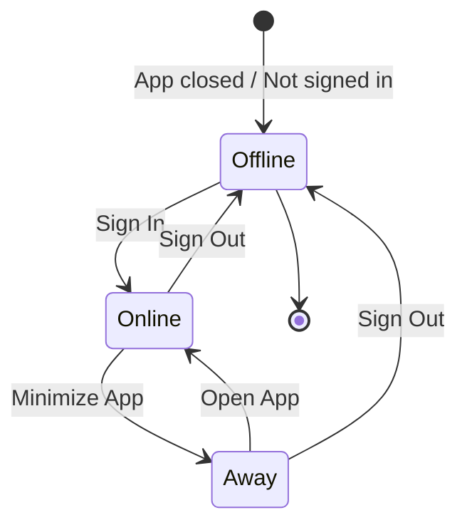

# App Lifecycle & User Presence

## 🎯 Overview

User online status now automatically updates based on **app lifecycle events** and **sign in/out actions**.

---

## 📱 Status Behaviors

### **🟢 ONLINE** - User is actively using the app
**Triggers**:
- ✅ User **signs in** (`AuthManager.signIn`)
- ✅ App becomes **active** (user opens/resumes app)

**Code**:
```swift
// YaipApp.swift - handleScenePhaseChange
case .active:
    PresenceService.shared.setOnline(userID: userID)
    print("🟢 User set to ONLINE")
```

---

### **🟠 AWAY** - User has app minimized
**Triggers**:
- ✅ App goes to **background** (user presses home button / switches apps)

**Code**:
```swift
// YaipApp.swift - handleScenePhaseChange
case .background:
    PresenceService.shared.updateStatus(.away, for: userID)
    print("🟠 User set to AWAY")
```

**Note**: We skip the `.inactive` state because it's a brief transition (e.g., pulling down notification center). We don't want to mark users as "away" for these momentary pauses.

---

### **⚪ OFFLINE** - User explicitly signed out
**Triggers**:
- ✅ User **signs out** (`AuthManager.signOut`)

**Code**:
```swift
// AuthManager.swift - signOut()
func signOut() async throws {
    if let userID = currentUserID {
        presenceService.setOffline(userID: userID)
        print("⚪ User set to OFFLINE")
    }
    try Auth.auth().signOut()
}
```

---

## 🔄 Complete Lifecycle Flow



---

## 📊 Status Transitions

| User Action | Old Status | New Status | Delay |
|-------------|-----------|-----------|-------|
| Signs in | Offline | **🟢 Online** | Instant |
| Opens app | Away | **🟢 Online** | Instant |
| Minimizes app | Online | **🟠 Away** | Instant |
| Signs out | Online/Away | **⚪ Offline** | Instant |
| App crashes | Online/Away | **🟠 Away** | On next open |

---

## 🧪 How to Test

### **Test 1: Minimize → Away**
1. **Sign in as User A** on Device 1
2. **Sign in as User B** on Device 2
3. View User A's conversation on **Device 2**
4. **User A minimizes app** (press Home button on Device 1)
5. ✅ **Device 2 should show User A as "Away" (orange dot) instantly**

### **Test 2: Resume → Online**
1. User A is minimized (showing as "Away")
2. **User A opens app again**
3. ✅ **Device 2 should show User A as "Online" (green dot) instantly**

### **Test 3: Sign Out → Offline**
1. User A is in the app (showing as "Online")
2. **User A signs out**
3. ✅ **Device 2 should show User A as "Offline" (gray dot) instantly**
4. ✅ **Status text should say "Last seen just now"**

---

## 🎨 Visual Indicators

### **Conversation List** (ConversationRow)
- 🟢 **Green dot** = Online (actively using app)
- 🟠 **Orange dot** = Away (app minimized)
- ⚪ **Gray dot** = Offline (signed out)

### **Chat Header** (ChatView)
- 🟢 **"Online"** = Actively using app
- 🟠 **"Away"** = App minimized
- ⚪ **"Last seen X ago"** = Signed out

---

## 🔧 Implementation Details

### **Files Modified**:
1. **YaipApp.swift** - App lifecycle monitoring
   - Added `@StateObject private var authManager = AuthManager.shared`
   - Updated `handleScenePhaseChange` to set online/away status

2. **AuthManager.swift** - Already handles sign in/out
   - `signIn()` → Sets online ✅
   - `signOut()` → Sets offline ✅

3. **PresenceService.swift** - Already has status methods
   - `setOnline(userID:)` ✅
   - `updateStatus(.away, for:)` ✅
   - `setOffline(userID:)` ✅

---

## ⚡ Real-Time Updates

All status changes trigger **Firestore listeners** which update the UI **< 1 second**:

```swift
// ConversationRow.swift & ChatView.swift
statusListener = PresenceService.shared.listenToPresence(userID: userID) { status, lastSeen in
    self.otherUserStatus = status  // Updates instantly!
}
```

---

## 📝 Edge Cases

### **App Crashes**
- If the app crashes while user is "Online", they remain "Online" in Firestore
- When they reopen the app, it sets them to "Online" again
- Other users continue to see them as "Online" (stale for ~1-2 minutes)
- **Future improvement**: Server-side heartbeat to detect inactive users

### **Network Loss**
- Firestore handles offline scenarios automatically
- Status updates queue locally and sync when connection returns
- Real-time listeners reconnect automatically

### **Multiple Devices**
- If user signs in on Device A and Device B simultaneously:
  - Both devices set user to "Online"
  - User appears "Online" to others
  - If user minimizes Device A, only that device sets "Away"
  - Device B is still active → User still shows "Online" ✅

---

## 🚀 Benefits

1. **Intuitive Behavior**
   - ✅ Signed out = Offline (not available)
   - ✅ Minimized = Away (might come back soon)
   - ✅ Active = Online (available to chat)

2. **Battery Efficient**
   - ✅ Uses native iOS lifecycle events
   - ✅ No polling or timers
   - ✅ Firestore WebSocket connections are optimized

3. **Real-Time**
   - ✅ All status changes appear instantly
   - ✅ No manual refresh needed
   - ✅ Feels responsive and modern

---

## 🐛 Troubleshooting

### Issue: Status not updating when minimizing
**Solution**: Check console logs for "🟠 User set to AWAY" message. If missing, check `YaipApp.swift` handleScenePhaseChange.

### Issue: User stuck on "Away" after reopening app
**Solution**: Check for "🟢 User set to ONLINE" message when app becomes active. Ensure authManager is properly initialized.

### Issue: Status takes 5+ seconds to update
**Solution**: Check network connection. Firestore listeners require internet to sync.

---

✅ **App lifecycle presence tracking is now live!**

