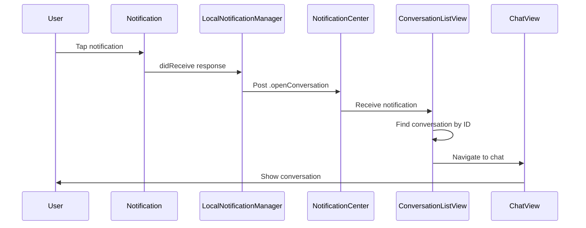

# Notification Deep Linking

## 🎯 Overview

When users tap on a notification, they are automatically navigated to the specific chat where the message was sent. This provides a seamless experience for responding to messages.

---

## ✨ How It Works



---

## 🔧 Implementation Details

### **1. Notification Creation (LocalNotificationManager)**

When sending a notification, we attach the conversation ID:

```swift
// LocalNotificationManager.swift - sendMessageNotification
content.userInfo = [
    "conversationID": conversationID,
    "type": "new_message"
]
```

**Key Points**:
- ✅ Every notification includes `conversationID` in `userInfo`
- ✅ This allows us to identify which chat to open

---

### **2. Notification Tap Handler (LocalNotificationManager)**

When user taps a notification, we extract the conversation ID and post to `NotificationCenter`:

```swift
// LocalNotificationManager.swift - userNotificationCenter(_:didReceive:)
func userNotificationCenter(
    _ center: UNUserNotificationCenter,
    didReceive response: UNNotificationResponse,
    withCompletionHandler completionHandler: @escaping () -> Void
) {
    let userInfo = response.notification.request.content.userInfo
    
    if let conversationID = userInfo["conversationID"] as? String {
        print("👆 User tapped notification - Opening conversation: \(conversationID)")
        
        // Post notification for deep linking
        Task { @MainActor in
            NotificationCenter.default.post(
                name: .openConversation,
                object: nil,
                userInfo: ["conversationID": conversationID]
            )
        }
    }
    
    completionHandler()
}
```

**Key Points**:
- ✅ Uses `UNUserNotificationCenterDelegate` protocol
- ✅ Posts to `NotificationCenter` (not the same as `UNUserNotificationCenter`)
- ✅ Runs on main actor to ensure UI updates happen on main thread

---

### **3. Deep Link Handling (ConversationListView)**

The conversation list listens for the deep link notification and navigates:

```swift
// ConversationListView.swift
struct ConversationListView: View {
    @State private var navigationPath = NavigationPath()
    
    var body: some View {
        NavigationStack(path: $navigationPath) {
            // ... conversation list UI ...
        }
        .onReceive(NotificationCenter.default.publisher(for: .openConversation)) { notification in
            handleDeepLink(notification)
        }
    }
    
    private func handleDeepLink(_ notification: Notification) {
        guard let conversationID = notification.userInfo?["conversationID"] as? String else {
            return
        }
        
        // Find the conversation in our list
        if let conversation = viewModel.conversations.first(where: { $0.id == conversationID }) {
            // Navigate to the conversation
            navigationPath.append(conversation)
            print("✅ Navigated to conversation: \(conversation.name ?? "Unknown")")
        }
    }
}
```

**Key Points**:
- ✅ Uses `NavigationPath` for programmatic navigation
- ✅ Listens for `.openConversation` notification using Combine
- ✅ Finds conversation by ID in the loaded conversations
- ✅ Uses `navigationPath.append()` to navigate

---

## 📱 User Experience

### **Scenario 1: App is in Background**
1. User receives message from Alice
2. **System notification appears** (banner or lock screen)
3. User **taps the notification**
4. ✅ App opens to **Alice's chat**
5. ✅ User can immediately reply

### **Scenario 2: App is in Foreground**
1. User receives message from Bob
2. **In-app banner appears** at the top
3. User **taps the banner** (if implemented)
4. ✅ App navigates to **Bob's chat**
5. ✅ User can immediately reply

### **Scenario 3: Multiple Notifications**
1. User receives 3 messages while away
2. User **taps any notification**
3. ✅ App opens to **that specific chat**
4. User can see all 3 chats in the conversation list

---

## 🧪 How to Test

### **Test 1: Background Notification Tap**
1. **Sign in as User A** on Device 1
2. **Sign in as User B** on Device 2
3. **Minimize app** on Device 1 (press home button)
4. **Send message** from User B to User A
5. **Device 1 shows notification**
6. **Tap the notification**
7. ✅ **App opens directly to the chat with User B**

### **Test 2: Multiple Conversations**
1. **User A has chats** with Bob, Carol, Dave
2. **Minimize app**
3. **Bob sends a message**
4. **Tap Bob's notification**
5. ✅ **App opens to Bob's chat (not Carol or Dave)**

### **Test 3: Group Chat Notification**
1. **User A is in group "Team"**
2. **Minimize app**
3. **Someone sends message** in "Team" group
4. **Tap the notification**
5. ✅ **App opens to "Team" group chat**

---

## 🎨 Console Output

When deep linking works correctly, you'll see:

```
👆 User tapped notification - Opening conversation: 1234-abcd-5678-efgh
🔗 Deep link: Opening conversation 1234-abcd-5678-efgh
✅ Navigated to conversation: Alice
```

---

## 🐛 Troubleshooting

### **Issue: Notification tap does nothing**
**Possible Causes**:
1. `UNUserNotificationCenterDelegate` not set
2. `NotificationCenter` notification not being posted
3. `ConversationListView` not listening

**Solution**: Check console for "👆 User tapped notification" message. If missing, delegate isn't working.

---

### **Issue: App opens but doesn't navigate**
**Possible Causes**:
1. Conversation not in the list yet (still loading)
2. Conversation ID doesn't match
3. `NavigationPath` not working

**Solution**: Check console for "⚠️ Conversation X not found in list". If present, conversation isn't loaded yet.

---

### **Issue: Navigates to wrong conversation**
**Possible Causes**:
1. Wrong conversation ID in notification
2. Conversation list contains duplicates

**Solution**: Check console logs to see which conversation ID was sent vs. which was opened.

---

## 📊 Technical Flow

```
1. MessageListenerService detects new message
   ↓
2. Calls LocalNotificationManager.sendMessageNotification(conversationID: "123", ...)
   ↓
3. Notification created with userInfo: ["conversationID": "123"]
   ↓
4. User taps notification
   ↓
5. userNotificationCenter(_:didReceive:) called
   ↓
6. NotificationCenter.default.post(name: .openConversation, userInfo: ["conversationID": "123"])
   ↓
7. ConversationListView.onReceive receives notification
   ↓
8. handleDeepLink(_:) extracts conversationID
   ↓
9. Finds conversation in viewModel.conversations
   ↓
10. navigationPath.append(conversation)
    ↓
11. NavigationStack navigates to ChatView
```

---

## 🔑 Key Files

| File | Purpose |
|------|---------|
| `LocalNotificationManager.swift` | Creates notifications with `conversationID`, handles taps |
| `ConversationListView.swift` | Listens for deep links, performs navigation |
| `Notification.Name+Extensions.swift` | Defines `.openConversation` notification name |

---

## 🚀 Future Enhancements

Potential improvements:
- ✅ **In-app banner tapping** - Make in-app banners also navigate
- ✅ **URL scheme** - Support `yaip://conversation/123` deep links
- ✅ **Widget support** - Open specific chats from home screen widget
- ✅ **Siri shortcuts** - "Open my chat with Alice"

---

## 📝 Notes

- Deep linking only works for **conversations that are already loaded**
- If user hasn't opened the app yet, conversations may not be in memory
- The app fetches conversations on launch, so deep linking should work within 1-2 seconds
- Works with both **1-on-1 chats** and **group chats**

---

✅ **Notification deep linking is now live!** Tap any notification to jump directly to that chat.


