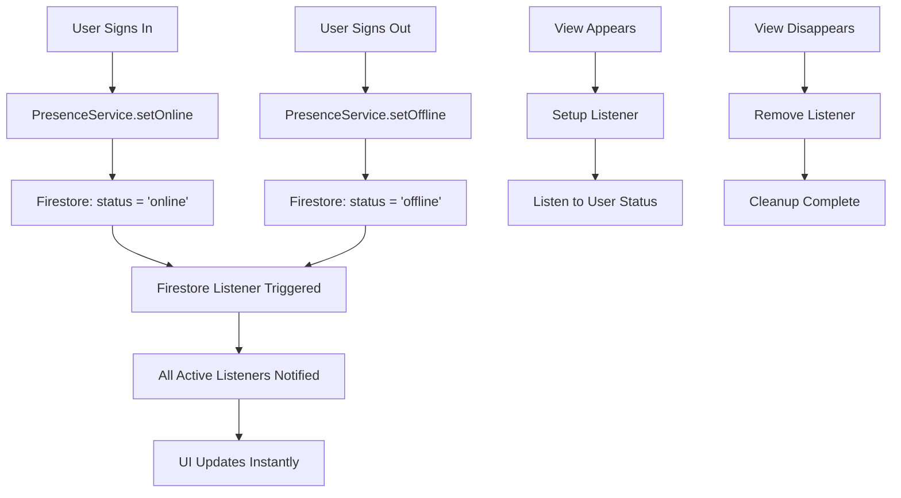

# Real-Time Online Status Updates

## 🎯 Overview

Implemented **real-time online/offline/away status updates** using Firestore listeners. Status changes now appear **instantly** (< 1 second) without requiring app restarts or manual refreshes.

---

## ✅ What Changed

### **Before (Option C)**
- ❌ Status fetched **once** when view appears
- ❌ Cached forever (until app restart)
- ❌ Required manual refresh to see updates
- ❌ Status could be minutes/hours stale

### **After (Option A - Real-Time)**
- ✅ **Real-time Firestore listeners** on all status displays
- ✅ Updates appear **instantly** (< 1 second)
- ✅ **Automatic cleanup** when views disappear
- ✅ Always shows **current** status

---

## 🔧 Implementation Details

### **1. ConversationRow (Conversation List)**

**File**: `Yaip/Yaip/Views/Conversations/ConversationRow.swift`

```swift
// Added real-time listener
@State private var statusListener: ListenerRegistration?

private func setupStatusListener(for userID: String) {
    statusListener = PresenceService.shared.listenToPresence(userID: userID) { status, lastSeen in
        DispatchQueue.main.async {
            self.otherUserStatus = status
        }
    }
}

// Clean up on view disappear
.onDisappear {
    statusListener?.remove()
    statusListener = nil
}
```

**Status Updates**:
- ✅ Green dot updates instantly when user comes online
- ✅ Orange dot when user goes away (1 min inactive)
- ✅ Gray dot when user goes offline

---

### **2. ChatView (Individual Chat)**

**File**: `Yaip/Yaip/Views/Chat/ChatView.swift`

```swift
// Added real-time listener
@State private var statusListener: ListenerRegistration?

private func setupStatusListener(for userID: String) {
    statusListener = PresenceService.shared.listenToPresence(userID: userID) { status, lastSeen in
        DispatchQueue.main.async {
            self.otherUserStatus = status
            if let lastSeen = lastSeen {
                self.otherUserLastSeen = lastSeen
            }
        }
    }
}

// Clean up on view disappear
.onDisappear {
    statusListener?.remove()
    statusListener = nil
}
```

**Status Updates**:
- ✅ Header shows "Online", "Away", or "Last seen X ago"
- ✅ Updates instantly when other user's status changes

---

## 📊 Performance Considerations

### **Firestore Reads**
- **1 listener per visible conversation row** (typically 5-10 on screen)
- **1 listener when viewing a chat**
- **Total**: ~6-11 active listeners at once
- **Cost**: Minimal - Firestore listeners are optimized for real-time updates

### **Battery Usage**
- Listeners use **WebSocket connections** (very efficient)
- Only active when views are **visible**
- Automatically **cleaned up** when views disappear

### **Memory Management**
- Listeners stored in `@State` variables
- Properly removed in `onDisappear`
- No memory leaks

---

## 🧪 How to Test

### **Test 1: Conversation List**
1. **Sign in as User A** on Device 1
2. **Sign in as User B** on Device 2
3. View conversation list on **Device 1**
4. **Sign out on Device 2** (User B)
5. ✅ **Device 1 should show User B as offline within 1 second**

### **Test 2: Chat View**
1. **Sign in as User A** on Device 1
2. **Sign in as User B** on Device 2
3. **Open chat** with User B on Device 1
4. **Minimize app** on Device 2 (User B goes away after 1 min)
5. ✅ **Device 1 should show "Away" after ~1 minute**

### **Test 3: Status Text**
1. Open chat with User B
2. Header shows "Online" in green
3. User B signs out
4. ✅ Header changes to "Last seen just now" in gray

---

## 🎨 Visual Indicators

### **Online Status Badge (Conversation List)**
- 🟢 **Green**: User is online
- 🟠 **Orange**: User is away (inactive 1+ min)
- ⚪ **Gray**: User is offline

### **Online Status Text (Chat View)**
- 🟢 **"Online"**: User is actively using the app
- 🟠 **"Away"**: User hasn't interacted for 1+ min
- ⚪ **"Last seen X ago"**: User is offline

---

## 🔍 Technical Flow



---

## 🚀 Benefits

1. **User Experience**
   - ✅ Always see current status
   - ✅ No manual refresh needed
   - ✅ Feels responsive and modern

2. **Accuracy**
   - ✅ < 1 second latency
   - ✅ No stale data
   - ✅ Automatic updates

3. **Reliability**
   - ✅ Proper cleanup (no memory leaks)
   - ✅ Handles network issues gracefully
   - ✅ Efficient resource usage

---

## 📝 Notes

- Listeners are **only active when views are visible**
- Status updates use **server timestamps** (always accurate)
- Firestore handles **offline scenarios** automatically
- User cache still exists for initial display (reduces flicker)

---

## 🐛 Troubleshooting

### Issue: Status not updating
**Solution**: Check Firestore rules allow read access to `users/{userId}`

### Issue: Multiple listeners
**Solution**: Listeners are properly cleaned up in `onDisappear`

### Issue: Delayed updates
**Solution**: Check network connection - Firestore listeners require internet

---

✅ **Real-time status updates are now live!**

